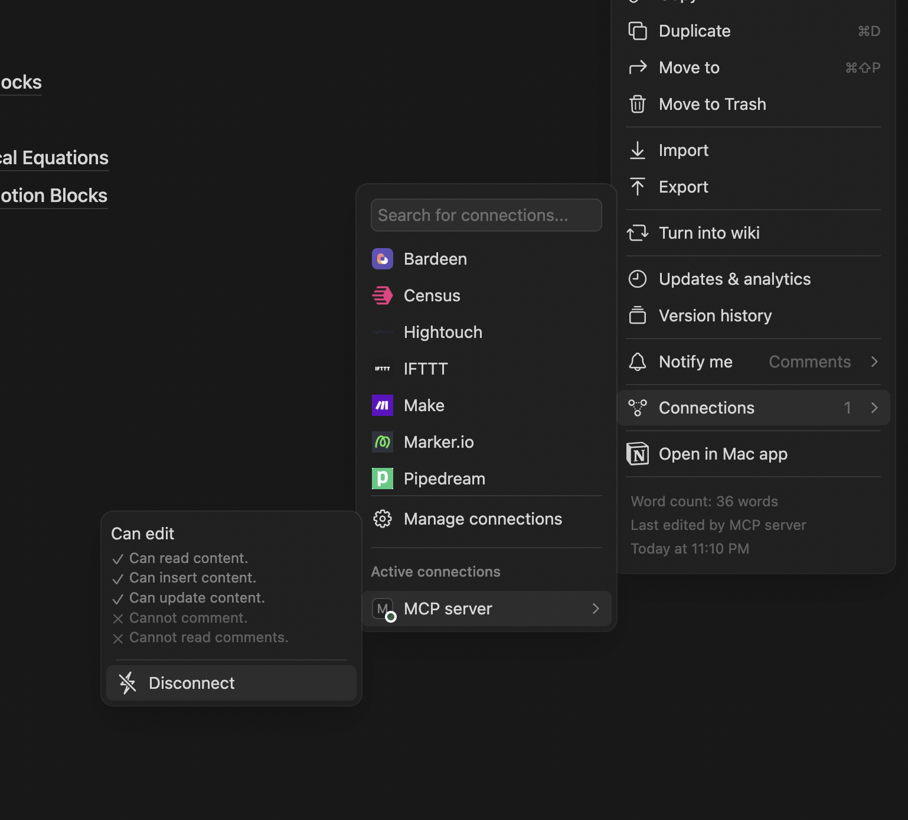

# Notion MCP Server


**Notion MCP Server** is a Model Context Protocol (MCP) server template for integrating with Notion's API. This boilerplate provides a starting point for building AI assistants that can interact with Notion.

## 📑 Table of Contents

- [Getting Started & Integration](#-getting-started--integration)
  - [Setup Process](#setup-process)
  - [Cursor Integration](#cursor-integration)
  - [Claude Desktop Integration](#claude-desktop-integration)
- [Features](#-features)
- [Documentation](#-documentation)
  - [Available Tools](#available-tools)
  - [Available Resources](#available-resources)
- [Development](#-development)
- [Technical Details](#-technical-details)
- [Troubleshooting](#-troubleshooting)
- [Contributing](#-contributing)
- [License](#-license)

## 🚀 Getting Started & Integration

### Setup Process

1. **Obtain a Notion API Key**
   - Create an integration at [Notion Developers](https://www.notion.so/my-integrations)
   - Copy your API key
   
2. **Enable Integration for Your Pages**
   - Select an existing page or create a new one in Notion
   - Click the "..." menu in the top right corner
   - Go to "Connections" 
   - Find and enable your integration from the list
   
   

3. **Choose Your Integration Method**
   - Follow one of the integration options below based on your preferred MCP client

4. **Ask Your AI Assistant to Interact with Notion**
   - "Create a new page with today's tasks"
   - "Update my meeting notes in Notion"
   - "Add bullet points to my meeting notes page"

### Cursor Integration

#### Method 1: Using mcp.json

1. Create or edit the `.cursor/mcp.json` file in your project directory:

```json
{
  "mcpServers": {
    "notion-mcp-server": {
      "command": "env NOTION_TOKEN=YOUR_KEY NOTION_PAGE_ID=YOUR_PAGE_ID npx",
      "args": ["-y", "notion-mcp-server"]
    }
  }
}
```

2. Replace `YOUR_KEY` and `YOUR_PAGE_ID` with your actual Notion API key and page ID
3. Restart Cursor to apply the changes

#### Method 2: Manual Mode

1. Open Cursor and go to Settings
2. Navigate to the "MCP" or "Model Context Protocol" section
3. Click "Add Server" or equivalent
4. Enter the following command in the appropriate field:

```
env NOTION_TOKEN=YOUR_KEY NOTION_PAGE_ID=YOUR_PAGE_ID npx -y notion-mcp-server
```

5. Replace `YOUR_KEY` and `YOUR_PAGE_ID` with your actual Notion API key and page ID
6. Save the settings and restart Cursor if necessary

### Claude Desktop Integration

1. Create or edit the `mcp.json` file in your configuration directory:

```json
{
  "mcpServers": {
    "notion-mcp-server": {
      "command": "npx",
      "args": ["-y", "notion-mcp-server"],
      "env": {
        "NOTION_TOKEN": "YOUR_KEY",
        "NOTION_PAGE_ID": "YOUR_PAGE_ID"
      }
    }
  }
}
```

2. Replace `YOUR_KEY` and `YOUR_PAGE_ID` with your actual Notion API key and page ID
3. Restart Claude Desktop to apply the changes

## 🌟 Features

- **📝 Notion Integration** - Interact with Notion databases, pages, and blocks
- **🔌 Universal MCP Compatibility** - Works with all MCP clients including Cursor, Claude Desktop, Cline, and Zed
- **🔍 Data Retrieval** - Fetch information from Notion pages, blocks, and databases
- **✏️ Content Creation** - Create and update Notion pages and blocks
- **📊 Block Management** - Append, update, and delete blocks within Notion pages
- **🔄 Batch Operations** - Perform multiple operations in a single request
- **🗑️ Archive & Restore** - Archive and restore Notion pages
- **🔎 Search Functionality** - Search Notion pages and databases by title

## 📚 Documentation

### Available Tools

The server provides the following tools for interacting with Notion:

#### Page Operations

##### `create_page`
Create a new page in Notion with specified content

##### `archive_page`
Archive (move to trash) a Notion page by ID

##### `restore_page`
Restore a previously archived Notion page by ID

##### `search_pages`
Search for pages and databases in Notion by title

#### Block Operations

##### `retrieve_block`
Retrieve a block from Notion by ID

##### `retrieve_block_children`
Retrieve the children of a block from Notion

##### `append_block_children`
Append child blocks to a parent block in Notion

##### `update_block`
Update a block's content in Notion

##### `delete_block`
Delete (move to trash) a block in Notion

#### Batch Operations

##### `batch_append_block_children`
Append children to multiple blocks in a single operation

##### `batch_update_blocks`
Update multiple blocks in a single operation

##### `batch_delete_blocks`
Delete multiple blocks in a single operation

##### `batch_mixed_operations`
Perform a mix of append, update, and delete operations in a single request

### Available Resources

The server currently does not expose any resources, focusing instead on tool-based operations.

## 🛠 Development

1. **Clone the Repository**
   ```
   git clone https://github.com/awkoy/notion-mcp-server.git
   cd notion-mcp-server
   ```

2. **Install Dependencies**
   ```
   npm install
   ```

3. **Set Up Environment Variables**
   - Create a `.env` file with:
     ```
     NOTION_TOKEN=your_notion_api_key
     NOTION_PAGE_ID=your_notion_page_id
     ```

4. **Build the Project**
   ```
   npm run build
   ```

5. **Run the Inspector**
   ```
   npm run inspector
   ```

## 🔧 Technical Details

- Built using TypeScript and the MCP SDK (version 1.7.0+)
- Uses the official Notion API client (@notionhq/client v2.3.0+)
- Follows the Model Context Protocol specification
- Implements tools for CRUD operations on Notion pages and blocks
- Supports efficient batch operations for performance optimization
- Validates input/output with Zod schemas

## ❓ Troubleshooting

- **Common Issues**
  - **Authentication Errors**: Ensure your Notion token has the correct permissions and integration is enabled for your pages/databases
  - **Page Access Issues**: Make sure your integration has been added to the pages you're attempting to access
  - **Rate Limiting**: Notion API has rate limits - use batch operations to optimize requests

- **Getting Help**
  - Create an issue on the [GitHub repository](https://github.com/awkoy/notion-mcp-server/issues)
  - Check the [Notion API documentation](https://developers.notion.com/reference/intro)
  - Visit the MCP community channels for assistance

## 🤝 Contributing

Contributions are welcome! Please feel free to submit a Pull Request.

1. Fork the repository
2. Create your feature branch (`git checkout -b feature/amazing-feature`)
3. Commit your changes (`git commit -m 'Add some amazing feature'`)
4. Push to the branch (`git push origin feature/amazing-feature`)
5. Open a Pull Request

## 📄 License

This project is licensed under the MIT License - see the LICENSE file for details.

